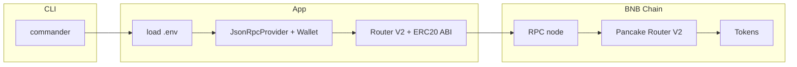

# BSC(BNB) Trading Bot
A **command-line trading toolkit** for **BNB Chain** focused on [Four.meme](https://four.meme)-style memecoin workflows. It talks **directly to the chain** through **PancakeSwap V2–compatible routers** (no centralized trading API). Use it to **snipe buys**, **run scripted routes**, **simulate volume**, or experiment with a **simple copy/mirror** flow — always with **`--dry-run`** first.

> **Disclaimer:** Trading memecoins is extremely risky. This software is provided as-is for education and automation. You are responsible for keys, RPC choice, taxes, and compliance. Nothing here is financial advice.

---

## Why this project?

| You want to… | Start here |
|----------------|------------|
| Buy tokens from BNB with set slippage | `sniper` |
| React when certain wallets hit the router | `copy` |
| Run one or more scripted WBNB → token buys | `bundle` |
| Repeat buy → sell on a timer (testing / activity) | `volume` |

---

## What’s under the hood



1. **`commander`** parses subcommands (`sniper`, `copy`, `bundle`, `volume`) and flags like `--config` and `--dry-run`.
2. **`dotenv`** loads `.env` (RPC URL, private key, chain id, router/WBNB addresses, optional Telegram).
3. **`ethers` v6** builds a **`JsonRpcProvider`** (your RPC) and a **`Wallet`** (your key). Contracts use the **router V2** and **ERC20** ABIs from `src/abis/`.
4. Each module reads a **JSON config file** (path via `-c`) and executes swaps on-chain. **`--dry-run`** skips sending transactions but still loads env and can run read-only calls where applicable.

**Stack:** Node.js (≥ 18.17) · TypeScript (compiled to CommonJS) · ethers v6 · axios (Telegram) · pino (logging).

---

## Modules in detail

### `sniper` — targeted buys

- **Config:** `config.sniper.example.json` → list of `targets`.
- **Flow:** For each target, the bot builds path **`WBNB → token`**, calls **`getAmountsOut`** on the router, applies **slippage** (`slippageBips`, e.g. `800` = 8%), then **`swapExactETHForTokens`** with your BNB (`maxBnb`).
- **Telegram (optional):** Sends a message before the buy and after confirmation (if `TELEGRAM_*` are set).

### `copy` — wallet-triggered mirror (simple)

- **Config:** `config.copy.example.json` — `targets` (addresses to watch), `defaultToken` (token you buy when triggered), `positionPercent`, `maxBnbPerTrade`.
- **Flow:** Subscribes to the **`pending`** tx stream. When a **watched address** sends a tx **to the router** (`ROUTER_V2_ADDRESS`), the bot executes a **separate** small WBNB → `defaultToken` swap (scaled by `positionPercent` / `maxBnbPerTrade`). It does **not** decode the leader’s calldata to copy the *same* token; it is a **naive mirror** into one configured token.
- **Note:** Pending-tx feeds depend on your RPC; reliability and speed vary. This is **not** a professional copy-trading engine.

### `bundle` — scripted routes

- **Config:** `config.bundle.example.json` — `routes` array.
- **Implemented today:** `kind: "buy"` only — WBNB → `token` for `amountBnb` with slippage and optional `deadlineSec`.

### `volume` — timed buy/sell loop

- **Config:** `config.volume.example.json` — `token`, `amountBnb`, `slippageBips`, `intervalMs`.
- **Flow:** On each interval: **buy** with `amountBnb`, then **approve** the router if needed, then **sell the full token balance** using **`swapExactTokensForETHSupportingFeeOnTransferTokens`** (fee-on-transfer friendly). Repeats until you stop the process.

---

## Environment variables

Copy `.env.example` to `.env` and fill in values.

| Variable | Required | Description |
|----------|----------|-------------|
| `RPC_URL` | Yes | HTTPS WebSocket/HTTP JSON-RPC endpoint for **BSC** (chain id **56**). Use a stable provider; free/public endpoints may rate-limit or return empty responses. |
| `PRIVATE_KEY` | Yes | Wallet private key (0x…). Used only locally to sign txs. |
| `CHAIN_ID` | No | Default **`56`** (BNB Chain mainnet). |
| `WBNB_ADDRESS` | No | Default: canonical **WBNB** on BSC. |
| `ROUTER_V2_ADDRESS` | No | Default: **PancakeSwap V2 router** on BSC. |
| `LOG_LEVEL` | No | `info` · `debug` · `error` |
| `TELEGRAM_BOT_TOKEN` | No | From [@BotFather](https://t.me/BotFather) — enables alerts. |
| `TELEGRAM_CHAT_ID` | No | Chat or channel id to receive messages. |

**RPC tip:** If you see ethers errors like **`BUFFER_OVERRUN`** / empty `0x` data, your RPC is likely returning bad or empty results for `eth_call` / `eth_chainId`. Try another BSC endpoint and confirm `CHAIN_ID` matches the network.

---

## JSON configs (examples)

| File | Purpose |
|------|---------|
| `config.sniper.example.json` | `targets[]`: `token`, `maxBnb`, `slippageBips` |
| `config.copy.example.json` | `targets[]`, `defaultToken`, `positionPercent`, `maxBnbPerTrade` |
| `config.bundle.example.json` | `routes[]`: `kind`, `token`, `amountBnb`, `slippageBips`, `deadlineSec` |
| `config.volume.example.json` | `token`, `amountBnb`, `slippageBips`, `intervalMs` |

Copy a file, edit addresses and amounts, then pass it with **`-c`**.

---

## Install & run

### Prerequisites

- **Node.js** ≥ **18.17** (LTS recommended)
- A **BNB-funded** wallet for gas and swaps
- A **reliable BSC RPC** URL

### Setup

```bash
git clone https://github.com/BNB-Alpha-Community/bnb-bundler.git
cd bnb-bundler
npm install
```

Create `.env` from `.env.example` and set at least `RPC_URL` and `PRIVATE_KEY`.

### Build

```bash
npm run build
```

### Commands

Global CLI name (after `npm link` or global install): **`fourmeme`**. Locally:

```bash
# Help
node dist/index.js --help
node dist/index.js sniper --help

# Development (TypeScript, watch mode)
npm run dev -- sniper
npm run dev -- copy
```

**Production-style (after build):**

```bash
# Sniper — dry-run first (no tx broadcast)
node dist/index.js sniper -c config.sniper.example.json --dry-run
node dist/index.js sniper -c my-sniper.json

# Copy trader
node dist/index.js copy -c config.copy.example.json

# Bundler
node dist/index.js bundle -c config.bundle.example.json

# Volume bot (runs until you stop the process)
node dist/index.js volume -c config.volume.example.json
```

All commands support **`--dry-run`** where the code skips signing/sending (useful for a quick sanity check).

---

## Project layout

```
src/
  index.ts              # CLI entry
  lib/
    config.ts           # .env loading
    provider.ts         # ethers provider + wallet
    logger.ts           # pino
    notifier.ts         # Telegram (optional)
  modules/
    sniper/Sniper.ts
    copytrader/CopyTrader.ts
    bundler/Bundler.ts
    volume/VolumeBot.ts
  abis/                 # Router V2 + ERC20 JSON ABIs
```

---

## Security & operations

- **Never commit `.env`** or keys. Use a **dedicated hot wallet** with small balances for experiments.
- **Verify** token and router addresses on [BscScan](https://bscscan.com) before live trading.
- **Slippage** (`slippageBips`) protects against price movement; too low may fail, too high increases adverse selection risk.
- **Copy module** is simplistic; leaders’ trades are not replicated token-for-token.
- **Volume bot** sells **full balance** each cycle; adjust strategy and size carefully.

---

## License

MIT — see `package.json`.

---

## Contributing

Suggestions and pull requests are welcome. If this project saves you time, a **star** on the repo helps others discover it.
